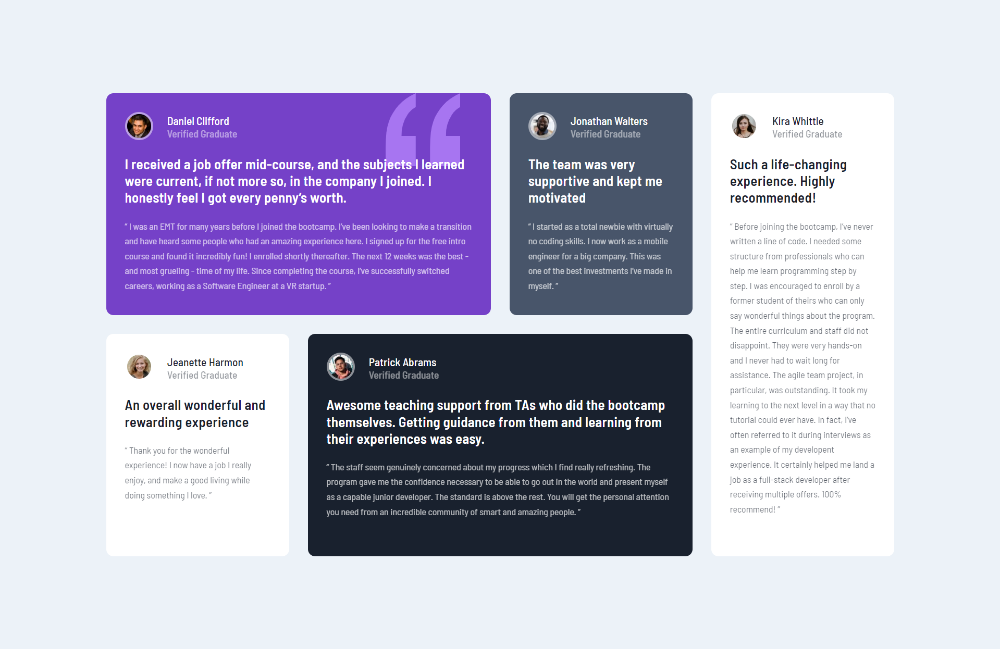

# Frontend Mentor - Testimonials grid section

## Welcome! 👋

Thanks for checking out this front-end coding challenge.

[Frontend Mentor](https://www.frontendmentor.io) challenges help you improve your coding skills by building realistic projects.

## The challenge

Your challenge is to build out this testimonials grid section and get it looking as close to the design as possible.

You can use any tools you like to help you complete the challenge. So if you've got something you'd like to practice, feel free to give it a go.

# Frontend Mentor - Testimonials grid section solution

This is a solution to the [Testimonials grid section challenge on Frontend Mentor](https://www.frontendmentor.io/challenges/testimonials-grid-section-Nnw6J7Un7). Frontend Mentor challenges help you improve your coding skills by building realistic projects.

## Table of contents

- [Overview](#overview)
  - [The challenge](#the-challenge)
  - [Screenshot](#screenshot)
  - [Links](#links)
- [My process](#my-process)
  - [Built with](#built-with)
  - [What I learned](#what-i-learned)
  - [Useful resources](#useful-resources)
- [Author](#author)
- [Acknowledgments](#acknowledgments)

**Note: Delete this note and update the table of contents based on what sections you keep.**

## Overview

### The challenge

Users should be able to:

- View the optimal layout for the site depending on their device's screen size

### Screenshot

### Links

- Solution URL: [GitHub Repository](https://github.com/rckash/testimonials-grid-section)
- Live Site URL: [GitHub Page](https://rckash.github.io/testimonials-grid-section)

## My process

### Built with

- Semantic HTML5 markup
- CSS custom properties
- CSS Grid
- Mobile-first workflow

### What I learned

I got my feet wet with CSS Grid. I learned using grid-template-rows and grid-template-columns to create basic grid layouts. I have also learned how to set up and use grid-template-area and grid-area.

Grid layouts have now opened me to the possibility of creating simple to complex layouts for multiple cards, images, etc.

### Continued development

Use this section to outline areas that you want to continue focusing on in future projects. These could be concepts you're still not completely comfortable with or techniques you found useful that you want to refine and perfect.

### Useful resources

- [Learn CSS Grid in 20 Minutes](https://www.youtube.com/watch?v=9zBsdzdE4sM) - This helped me understand using grid template areas better.
- [Learn CSS Grid - A 13 Minute Deep Dive](https://www.youtube.com/watch?v=EiNiSFIPIQE&t=725s) - This is an amazing video that taught me how CSS Grid generally works.

## Author

- Website - [Rirrucham Kashyap](https://github.com/rckash/)
- Frontend Mentor - [@rckash](https://www.frontendmentor.io/profile/rckash)

## Acknowledgments

I would like to thank Web Dev Simplified and Slaying The Dragon for uploading greatly helpful videos for developing responsive websites on their YouTube channel. Their dedication to teaching and creating entertaining videos as well have always been helpful to my learning journey.
